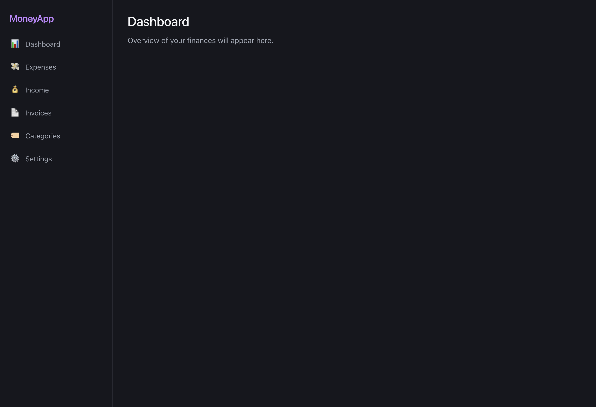
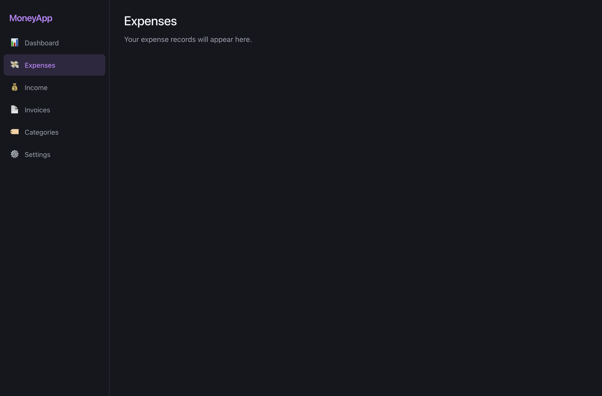
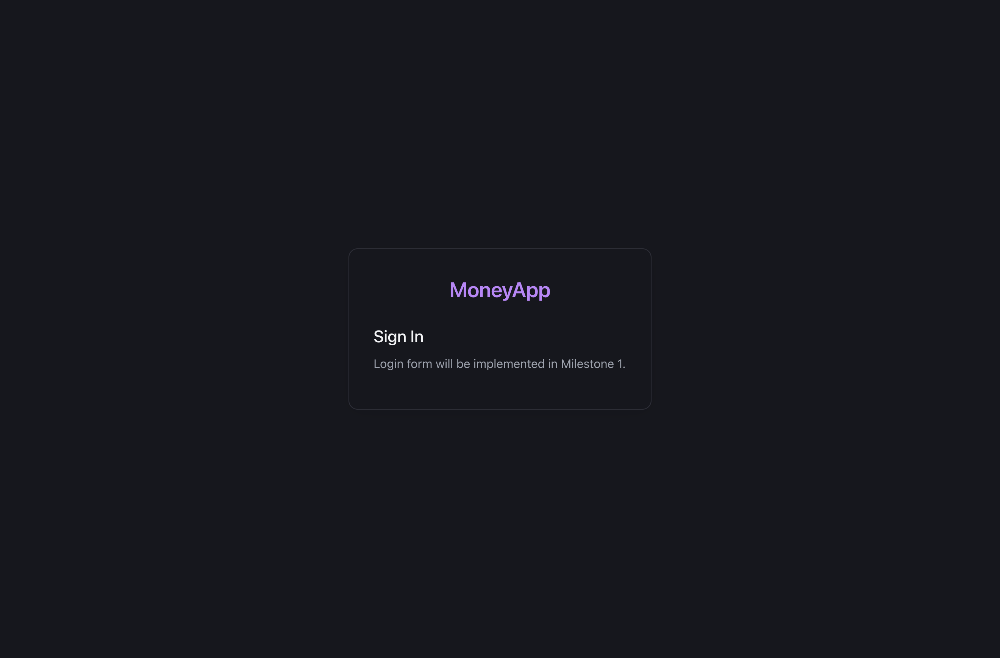
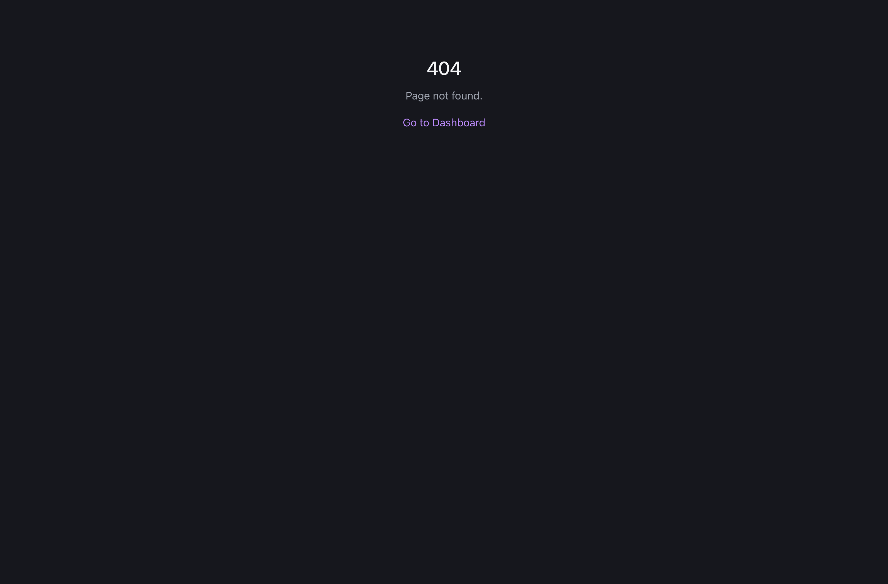
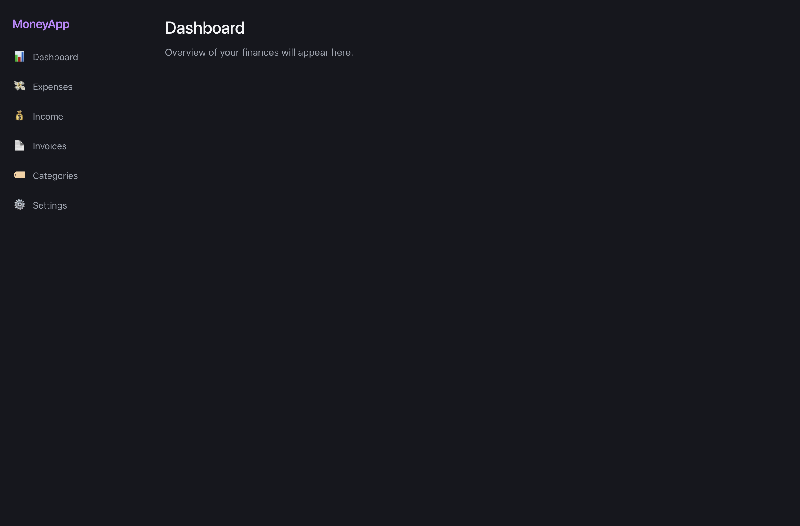
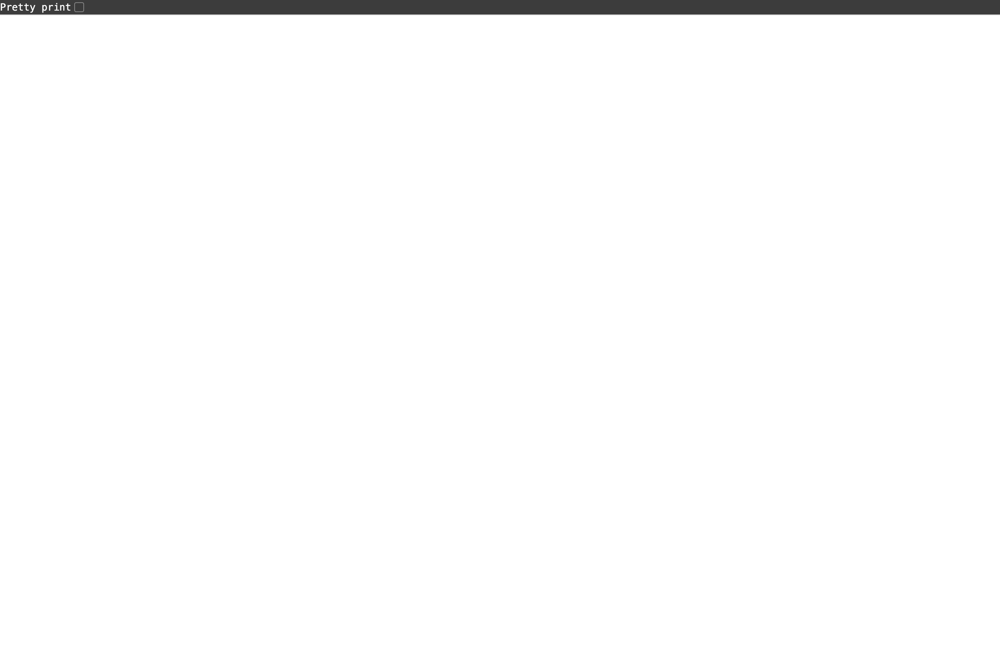

# Milestone 0 — Project Foundation: Status Report

**Last updated**: 2026-04-26  
**Overall status**: ✅ Complete (with minor notes)

---

## Executive Summary

All eight Milestone 0 tickets (M0-01 through M0-08) have been implemented and verified against the codebase. The backend infrastructure (migration runner, config loader, API middleware, health endpoint) and frontend shell (routing, layouts, pages, API client) are in place. Docker Compose now covers the full stack (MinIO + backend + frontend) with health-check dependency ordering, and a GitHub Actions CI pipeline covers lint, build, and test for both workstreams. The QA test plan (`docs/test-plans/milestone-0.md`) is complete and covers all eight tickets with 48 test cases and a documented automation backlog. Two minor deviations from ticket specs are noted below but do not block progression to Milestone 1. Visual evidence from a live local run (2026-04-26) is captured as PNG screenshots in this folder — see **QA — Visual Verification (M0)** section below.

---

## Tech Lead — M0 Implementation

Evidence was gathered by inspecting file presence, content, and structure in the repository. No automated test run was executed (MinIO not running in this context).

| Ticket | Title | Status | Evidence |
|--------|-------|--------|----------|
| **M0-01** | Database Migration Runner | ✅ Done | `backend/internal/database/migrate.go` — `RunMigrations(db, embed.FS)` sorts `.up.sql` files by name, skips already-applied ones, executes each in a transaction with rollback on error, records in `migrations` table. `backend/migrations/001_create_users.up.sql` creates `users` table with required columns. `database.Open()` calls `RunMigrations`. |
| **M0-02** | Environment Configuration | ✅ Done | `backend/internal/config/config.go` — `Config` + `Load()` includes `STORAGE_TYPE`, `LOCAL_STORAGE_PATH`, MinIO fields, JWT, DB, etc. `.env.example` documents the full set. `cmd/server/main.go` uses `config.Load()`. |
| **M0-03** | API Error Handling & Response Patterns | ✅ Done | `backend/internal/handlers/response.go` — `respondJSON`, `respondError`, `decodeJSON` (1 MB limit via `MaxBytesReader`), `ListResponse[T]`, `SingleResponse[T]`, `ErrorResponse`. `backend/internal/handlers/middleware.go` — `LoggingMiddleware` (method/path/status/duration), `RecoveryMiddleware` (panic → 500 + log stack), `CORSMiddleware` (configurable origin, OPTIONS 204). All three wrappers applied in `main.go`. `/api/health` uses `respondJSON`. |
| **M0-04** | Frontend Routing & App Shell | ✅ Done | `frontend/src/App.tsx` — BrowserRouter with routes for `/login` (AuthLayout), `/dashboard` (AppLayout, index redirect from `/`), `/expenses`, `/income`, `/invoices`, `/categories`, `/settings`, and `*` → NotFoundPage. All 8 page files present under `src/pages/`. `AppLayout.tsx`, `AuthLayout.tsx` in `src/layouts/`. `Sidebar.tsx`, `Toast.tsx` (with ToastProvider) in `src/components/`. |
| **M0-05** | Frontend API Client | ✅ Done | `frontend/src/api/client.ts` — `apiClient` with `get/post/put/delete/upload` methods, JWT injection from localStorage, 401 → clear token + redirect. `frontend/src/types/api.ts` — `ApiResponse<T>`, `ApiListResponse<T>`, `ApiError`. `frontend/src/api/auth.ts` — stub login/logout. `frontend/src/hooks/useAuth.ts` — auth state with localStorage persistence. |
| **M0-06** | Health Check Endpoint Enhancement | ✅ Done | `backend/internal/handlers/health.go` — `GET /api/health` pings DB and the configured `storage.ObjectStore` (`HealthCheck`). JSON includes `storage_type` (`local` \| `s3`). 503 when DB fails; degraded when storage check fails while DB is up. |
| **M0-07** | Docker Compose Enhancement | ✅ Done | `docker-compose.yml` — MinIO service has `healthcheck` (`mc ready local`). `backend` service builds from `backend/Dockerfile`, depends on MinIO with `condition: service_healthy`, exposes port 8080. `frontend` service builds from `frontend/Dockerfile` (nginx), exposes port 3000. `backend/Dockerfile` and `frontend/Dockerfile` both present. |
| **M0-08** | CI Pipeline Setup | ✅ Done | `.github/workflows/ci.yml` — `backend` job: `go vet ./...`, `go build ./cmd/server`, `go test ./...`. `frontend` job: `npm ci`, `npm run lint`, `npm run build`. Triggers on `push` and `pull_request`. |

### Minor deviations / notes

1. **M0-07 — MinIO health check command**: Ticket specifies `curl --fail http://localhost:9000/minio/health/live`; implementation uses `mc ready local`. Functionally equivalent; both verify MinIO readiness before the backend starts.

2. **M0-08 — CI branch trigger scope**: Ticket AC1 says "on every push and PR." The current `ci.yml` triggers only on pushes/PRs **targeting `main`**. Feature branch pushes that do not target `main` will not trigger CI. This is a minor gap; expanding the trigger to `branches: ["**"]` (or removing the branch filter) would fully satisfy the acceptance criterion.

---

## QA — Test Planning

**Document**: [`docs/test-plans/milestone-0.md`](../test-plans/milestone-0.md)  
**Status**: Draft (dated 2026-04-26) — live visual verification of M0-04 routing scenarios completed 2026-04-26; see **QA — Visual Verification (M0)** section and PNG screenshots in this folder.

| Ticket | Test Suite | Cases | AC Bullets Covered |
|--------|------------|-------|--------------------|
| M0-01 | TS-01 | 6 | AC1, AC2, AC3 |
| M0-02 | TS-02 | 5 | AC1, AC2, AC3 |
| M0-03 | TS-03 | 8 | AC1, AC2, AC3 |
| M0-04 | TS-04 | 8 | AC1, AC2, AC3, AC4 |
| M0-05 | TS-05 | 6 | AC1, AC2, AC3 |
| M0-06 | TS-06 | 6 | AC1, AC2, AC3 |
| M0-07 | TS-07 | 4 | AC1, AC2 |
| M0-08 | TS-08 | 5 | AC1, AC2, AC3 |
| **Total** | | **48** | All AC bullets across all 8 tickets |

The plan includes:
- Environment matrix (6 environments: `local-fresh`, `local-configured`, `local-minio-down`, `local-db-corrupt`, `local-partial-migrations`, `docker-compose`)
- Traceability matrix mapping each ticket to its test suite and AC coverage
- Cross-cutting security spot-checks and a startup smoke-test script
- Automation backlog with Playwright selectors for frontend routing and API client 401 handling, and Go integration test stubs for the migration runner, health handler, and config loader

**Documented gaps in the test plan** (noted by the tester, not blocking sign-off):

| Gap | Ticket | Detail |
|-----|--------|--------|
| JWT_SECRET policy unspecified | M0-02 | AC2 allows "warn or error" — policy not decided; TS-02-04 covers both outcomes |
| No panic-injection endpoint | M0-03 | Black-box panic test (TS-03-03) requires a dev-only `/debug/panic` endpoint or a unit test |
| Toast testability | M0-04 | No programmatic trigger defined in M0; TS-04-08 is conditional |
| `useAuth` page-refresh hydration | M0-05 | Hook re-hydration from localStorage on mount is implied, not explicitly tested |
| DB-down simulation | M0-06 | SQLite embedded — simulating `db.Ping()` failure requires a unit test approach |

None of the gaps represent missing test coverage for primary happy-path flows; all are edge cases or tooling concerns flagged for future automation.

---

## QA — Visual Verification (M0)

**Date**: 2026-04-26  
**Method**: Cursor browser automation (cursor-ide-browser MCP) against a live local run — backend with `CGO_ENABLED=1 STORAGE_TYPE=local` on `:8080`, frontend via `npm run dev` on `:5173`.  
**Health check**: `GET /api/health` returned `{"status":"ok","database":"ok","storage":"ok","storage_type":"local"}` (HTTP 200) confirming the full local stack was healthy before visual tests ran.

All four required M0-04 routing scenarios were exercised and captured as screenshots. The app renders consistently: dark theme, purple brand accent, readable typography, no blank white screens or unstyled HTML on any route.

**Checklist**

- [x] `/` → redirects to `/dashboard` → `DashboardPage` inside `AppLayout` with sidebar showing all 6 nav links
- [x] `/expenses` → `ExpensesPage` inside `AppLayout`; "Expenses" link in sidebar shows active/highlighted state
- [x] `/login` → `LoginPage` inside `AuthLayout`; **no sidebar**; centered card layout with "MoneyApp" heading and "Sign In" sub-heading
- [x] `/foo/bar` → `NotFoundPage` with "404" heading, "Page not found." message, and "Go to Dashboard" link; no sidebar
- [x] `GET /api/health` → 200 OK, all four keys present (`status`, `database`, `storage`, `storage_type`)
- [x] TS-04-06 — At **≤767px** viewport width the sidebar is **off-canvas** (drawer); a **☰** control opens it; main content uses full width. *(2026-04-26 follow-up: fixed flex layout — `Sidebar` previously returned a fragment, so `AppLayout`’s flex saw multiple children and reserved desktop width for the fixed `aside`.)*

**Screenshots**

---

## Risks / Blockers / Follow-ups

| Item | Severity | Detail |
|------|----------|--------|
| CI branch filter | Low | `ci.yml` only triggers on `main`-targeting pushes/PRs; feature branches are not gated. Expand trigger to cover all branches before M1 work begins. |
| JWT_SECRET policy | Low | Decide between "warn and continue with dev default" vs "fatal error in production" before M1 (auth endpoints depend on this). |
| Tests not run in CI | Low | No automated tests exist yet; the Go test job in CI will pass vacuously until unit/integration tests are written. The automation backlog in the test plan addresses this. |
| MinIO healthcheck image | Info | `mc` (MinIO client) may not be present in the `minio/minio:latest` image by default on all versions — validate `docker compose up` succeeds locally before M1. |

---

## Suggested Next Milestone Prep

Milestone 1 (MVP Core) depends directly on all M0 infrastructure being runnable end-to-end. Before starting M1 tickets, confirm that `docker compose up --build` completes without errors, that `GET /api/health` returns `{"status":"ok",...}`, and that the frontend dev server renders the app shell at `http://localhost:5173`. Resolve the `ci.yml` branch-filter gap so all M1 feature branches are gated by CI from the first commit.
