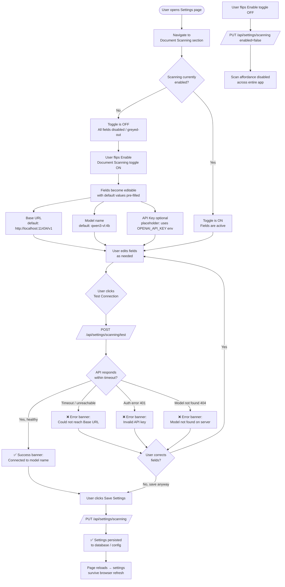
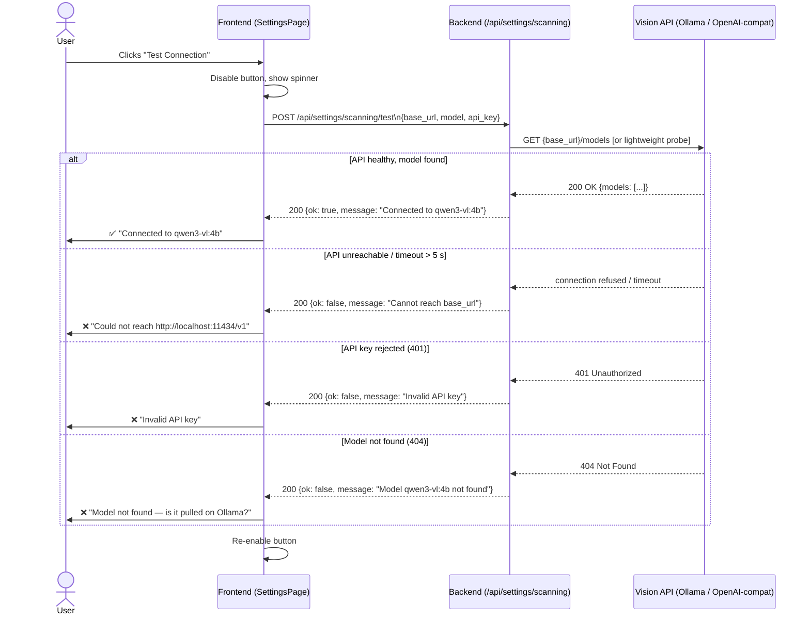
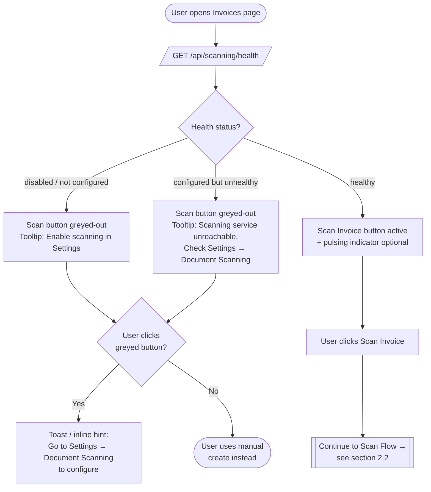
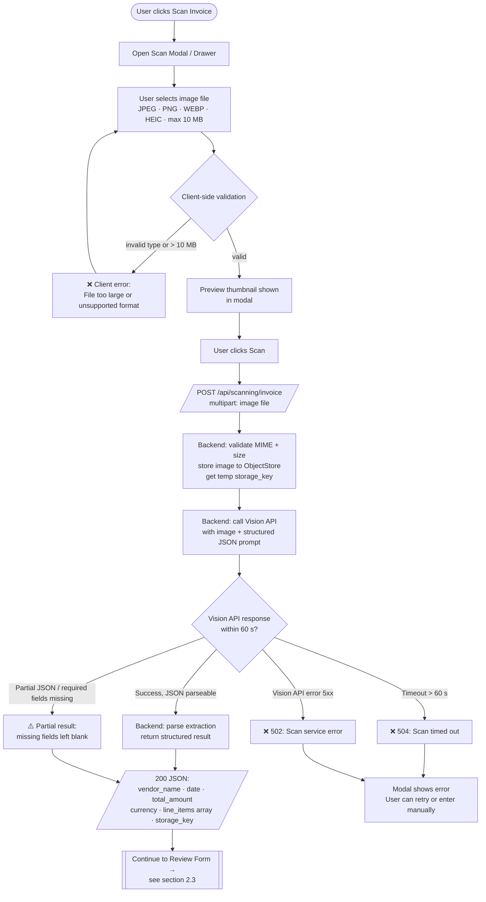
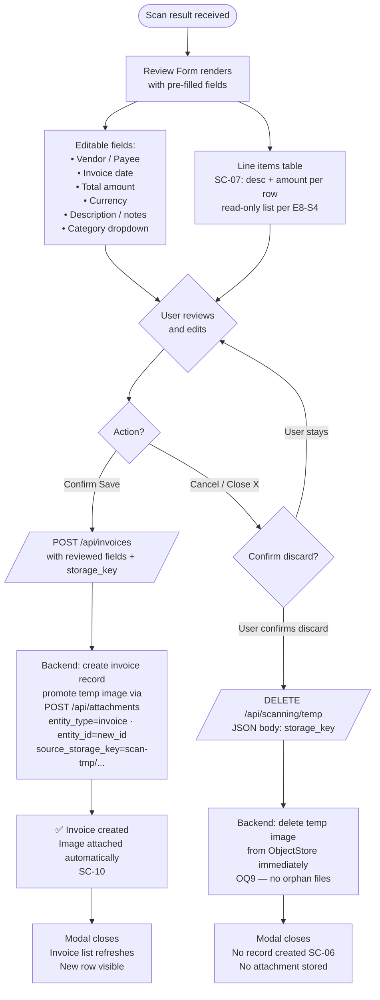
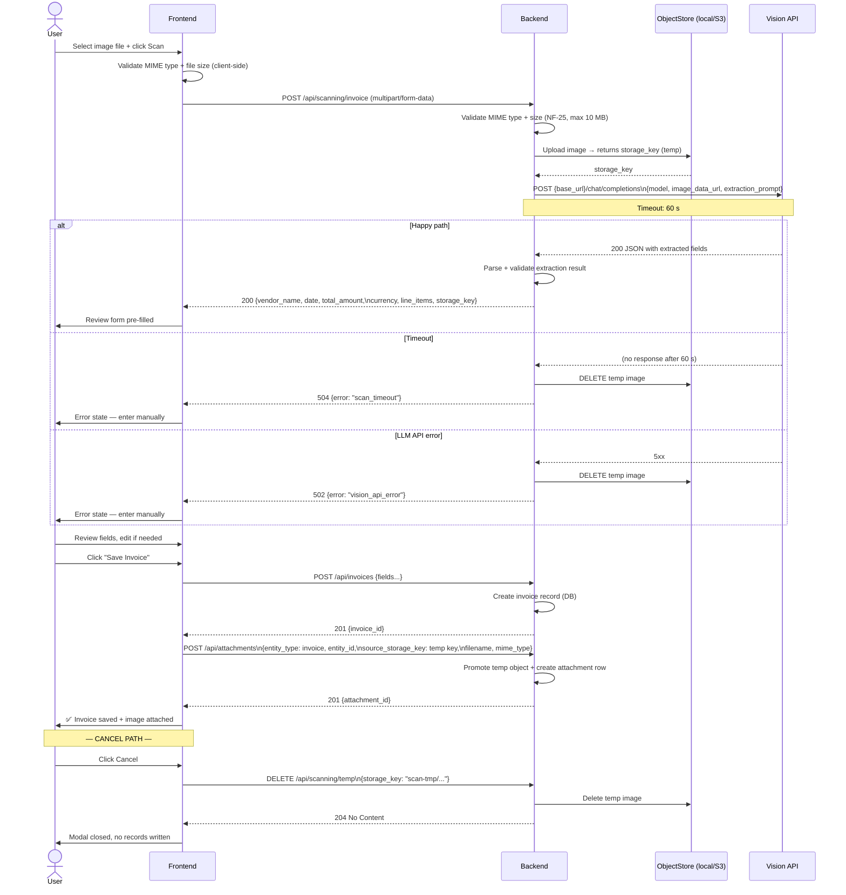

# Invoice Document Scanning — User Flow Diagrams

**Feature scope**: Milestone 3 — Document Scanning (Epic 8, SC-01 – SC-14)  
**Last updated**: 2026-04-27  
**Author**: QA/UX Tester agent

**Route source of truth**: HTTP paths and payloads in this doc are aligned with **`docs/tickets.md`** (Epic 8 + API appendix). If anything drifts during implementation, update tickets first, then this file.

---

## 1. Settings Flow — Configure Scanning

Users reach Scanning Settings via **Settings → Document Scanning** in the sidebar navigation.

### 1.1 Settings Configuration Flowchart

### 1.2 Settings Data Model

| Field | Type | Default | Notes |
|---|---|---|---|
| `enabled` | boolean | `false` | Master gate for scan feature |
| `base_url` | string | `http://localhost:11434/v1` | OpenAI-compatible endpoint |
| `model` | string | `qwen3-vl:4b` | Vision model identifier |
| `api_key` | string | `""` | Optional; falls back to `OPENAI_API_KEY` env var |

### 1.3 Test Connection — Sequence Diagram

---

## 2. Usage Flow — Scan an Invoice

Users initiate scanning from the **Invoices** page (primary entry point per M3 exit criteria).

### 2.1 Scan Feature Gate

### 2.2 Full Scan Flow — Happy Path

### 2.3 Review Form — Confirm or Cancel

### 2.4 Full API Sequence — Scan to Save

---

## 3. Edge Cases — QA Verification Checklist

The following edge cases **must** be covered in manual or automated testing before M3 sign-off:

1. **Ollama not running** — Test Connection and Scan both fail with a clear, user-readable message (not a raw HTTP error). The app must not crash or freeze.

2. **Ollama running but model not pulled** — `/api/models` returns 200 but `qwen3-vl:4b` is absent. Backend must distinguish "API reachable" from "model available" and surface a specific error: _"Model qwen3-vl:4b not found. Run `ollama pull qwen3-vl:4b`."_

3. **Vision API timeout (> 60 s)** — Backend enforces a hard 60-second timeout. The temp image stored in ObjectStore must be deleted on timeout; no orphan file is left behind.

4. **Unreadable / blurry image** — LLM returns a response but with no extractable financial fields. System treats this as a partial result (SC-05): review form opens with all fields blank, banner reads _"Could not extract data from image — please fill in manually."_ No hard error.

5. **Partial JSON from Vision API** — LLM response is valid JSON but missing required fields (e.g., `total_amount` absent). Backend must accept the partial result, return `null` for missing fields, and let the user fill gaps in the review form rather than failing the entire scan (D9 risk).

6. **Malformed JSON from Vision API** — LLM response cannot be parsed as JSON at all. Backend must catch the parse error and return a degraded result (all fields null / empty) rather than propagating a 500. Review form opens in manual-entry mode.

7. **User cancels after image uploaded but before scanning** — If the modal is closed before the scan API is called, no image has been written to ObjectStore yet, so no cleanup is needed. If the scan is in-flight, the frontend must wait for the response (or abort with a cancel signal), then send the DELETE temp request with the `storage_key` from the response.

8. **User cancels after scan succeeds but before saving** — The review form has a `temp_storage_key` from the scan response. Clicking Cancel must trigger `DELETE /api/scanning/temp` with JSON body `{ "storage_key": "scan-tmp/..." }` and receive 204. Verify in ObjectStore that the file is gone (no orphan per OQ9).

9. **Settings persistence across reload** — After saving scan settings, reload the page. All values — enabled toggle, base URL, model name, API key presence (masked) — must be restored from the database without re-entry.

10. **API key env-var fallback** — If the API key field is left blank in Settings, the backend must silently use the `OPENAI_API_KEY` environment variable (NF-26). A scan should succeed when the env var is set and the field is empty; fail with "Invalid API key" only when neither the field nor the env var provides a key.

---

## 4. Out-of-Scope Reminders (Do Not Test in M3)

- Batch scanning of multiple images (SC-16 — Won't have)
- On-device OCR / Tesseract.js (SC-15 — Won't have)
- Camera capture via `<input capture>` (SC-12 / E8-S8 — deferred to M4)
- Scan audit log / `scan_results` table (SC-13 — Could have, deferred)
- Category auto-suggestion from vendor name (SC-14 — Could have, deferred)
- Multi-user / shared scanning credentials (out of scope entirely)
